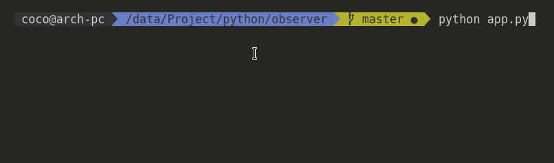

# testPython

The purpose of this app is to make me more familar with the language python.
the app is a window that describes a flower and its leaves. Every second that passes the flower loses a leaf. You can press a button to recreate it.

I used the obeserver / observable design pattern with multithreading.



# Requirement
  
  - python (3+)
  - tkinter library

# Installation

  - Download latest version (```git clone https://github.com/clabroche/testPython.git```)

If you want to make standalone:
  - ```pip install cx_Freeze --upgrade```
  - ```cxfreeze app.py```
 
 
# Usage
  
  ```python app.py```
  or 
  Double click on ```dist/app``` if you have make a binary
  
